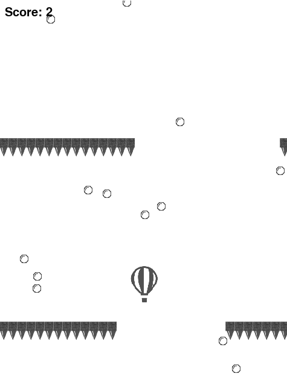

<h1 align="center">Welcome to Pygame Balloon Game 👋</h1>
<p>
</p>

> Pygame implementation of balloon rising game found in Google Play Store

## Screenshot



## Install

Clone this repo then

```sh
pip install -r requirements.txt
```

## Usage

```sh
cd src && python3 main.py
```

## Author

👤 **Madhav Goyal**

- Github: [@MadhavGoyal-6](https://github.com/MadhavGoyal-6)

## Show your support

Give a ⭐️ if this project helped you!

---

_This README was generated with ❤️ by [readme-md-generator](https://github.com/kefranabg/readme-md-generator)_
